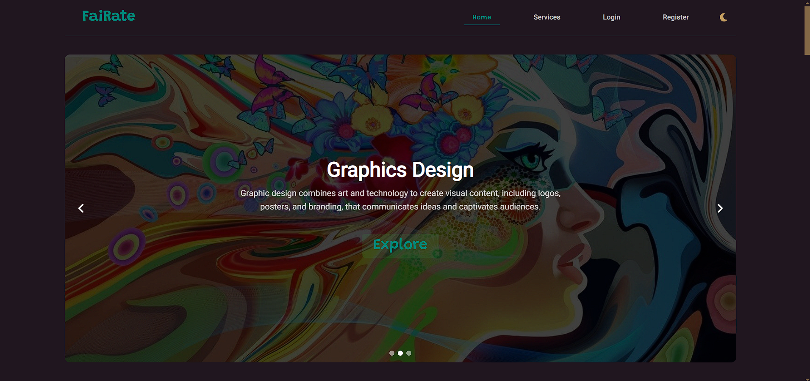
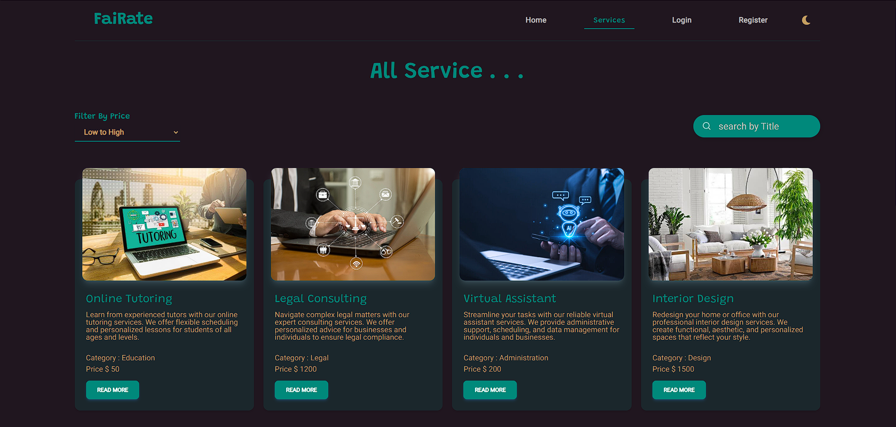
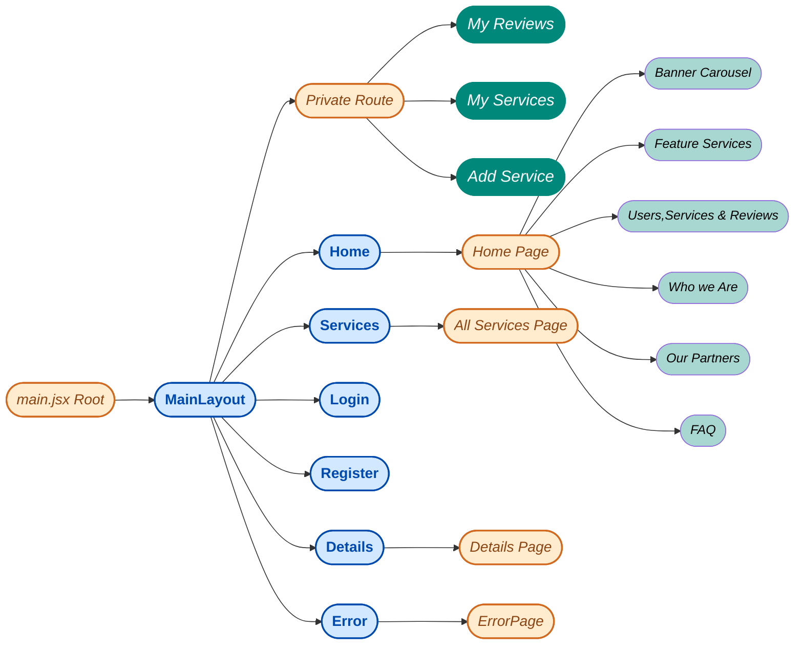
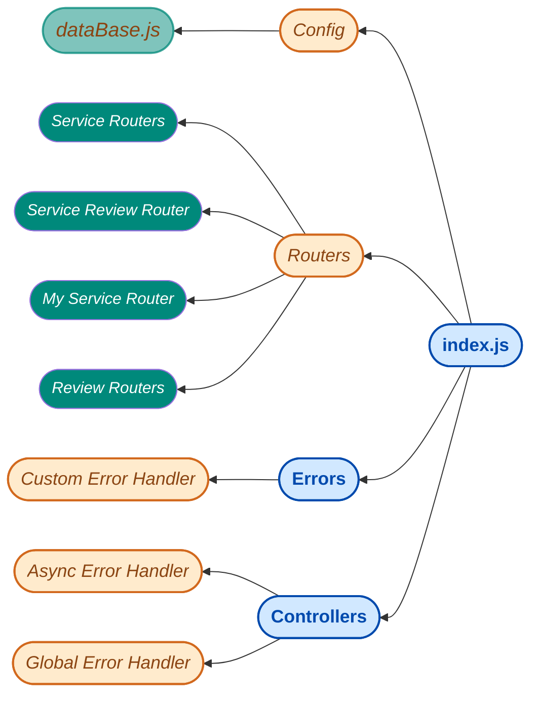

<a>
<h1 align="center">FaiRate</h1>

Service sharing Platform

</a>

***
#### *Purpose*
*The purpose of this website is to create a collaborative platform where users can review, share, and interact with various services. It allows users to log in securely, add their services, and provide valuable insights through detailed reviews. By enabling users to manage their contributions and explore others' feedback, the system fosters informed decision-making and trust within the community. This platform also serves as a practical learning tool, demonstrating the implementation of a full-stack application. It highlights key functionalities such as user authentication, seamless CRUD operations, secure database management, and interactive review systems, making it a comprehensive and engaging experience.*

#### *Features*
*User information are secured here with google Firebase auth*
- *User can Roaming here freely and can share services*
- *Only signed in user can share their thoughts in this platform*
- *User can check their contribution and even can update it whenever they need to do*
- *Google sign in and email sign is so simple no need to verify email or password **(Note:password should be 6characters long and must have a special character, one uppercase and lowercase letters)***
- *only Signed up user can post, edit, delete reviews*
- *On detail page user will see the review cunt of that specific service and can add their own reviews there*
- *Only Signed in user can add services, and can update or delete his post*

#### *Technologies*
***This simple single page website was created with-***
- ***Framer Motion***
  - Basic Enter Animation.
  - Gestures.
  - WhileInView
  
- ***React with Vite***
    - useState 
    - useEffect,
    - Context API..
    - Custom Hooks..
    - Reusable Components.
  
- ***React Router Dom***
  - useRouterError,
  - Navigate Component,
  - Outlet,  
  - useNavigate,
  - useLocation,
  - Link
  - NavLink
- ***Firebase Authentications***
  - Google SigIn
  - Sign Up with Email and Password
  - Update Profile
  - Signin with Email & Password

- ***Node js & Express js***
  - POST
  - GET
  - PUT
  - PATCH
  - DELETE methods
  - Router
  - Middlewares
  - Error handlers
- ***MongoDB.***
  - insertOne()
  - find()
  - findOne()
  - DeleteOne()
  - updateOne()
- ***Others***
  - tanStackQuery
  - axios
  - react-hook-form
  - react-rating-stars-component
  - react-toastify
  - react-countUp 
  - sweetalert2
  - material-tailwind
  - daisy-ui
  - lenis

 

<a>
<h1 align="center">Routes & Components</h1>
</a>

 

<a>
<h1 align="center">Server Routers and Handlers</h1>
</a>

***
[_Server Repo_](https://github.com/Dev-NayanBiswas/Assignment-11-Server)
 
[_Feel Free to Visit **FaiRate**_](https://assignment-11-fairate.netlify.app/)

 
 
 
 

    <a>
    <h4><i></i></h4>
    </a>
    

 
 
 
 
 

### *Thanks for Visiting*
### <a>*FaiRate*</a>

***Learning to write programs stretches your mind, and helps you think better, creates a way of thinking about things that I think is helpful in all domains.***

<a> ― *Bill Gates*</a> 

